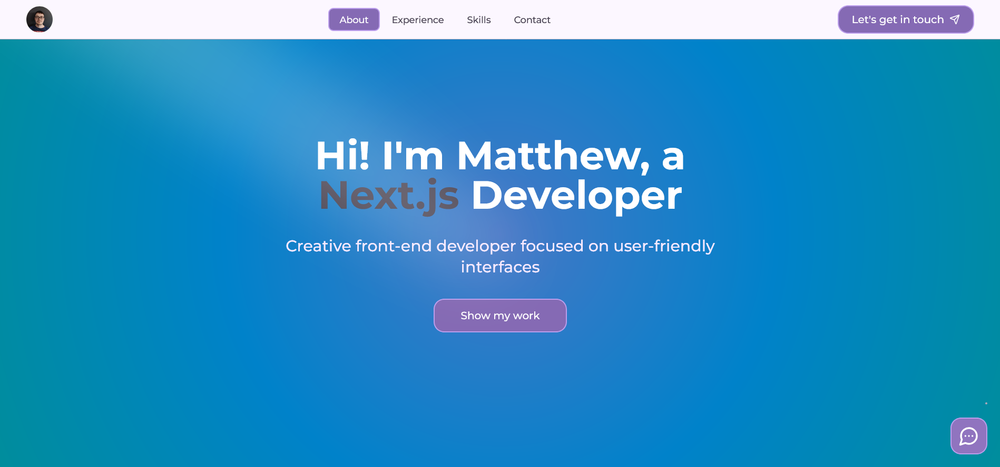
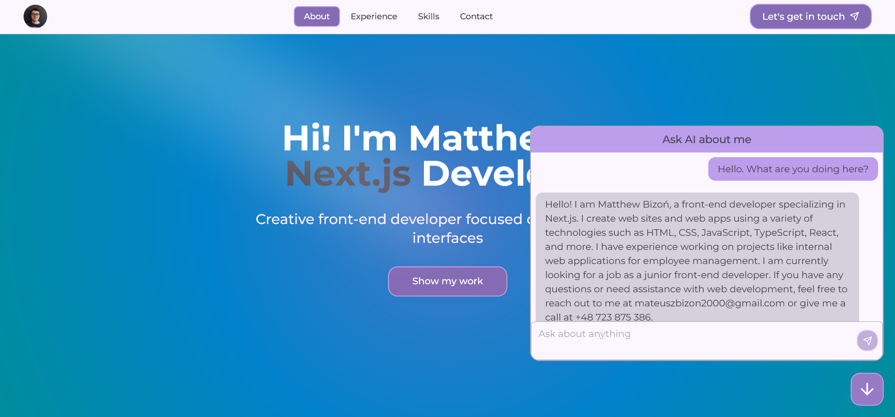
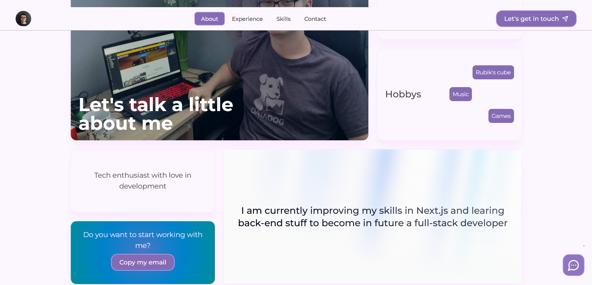
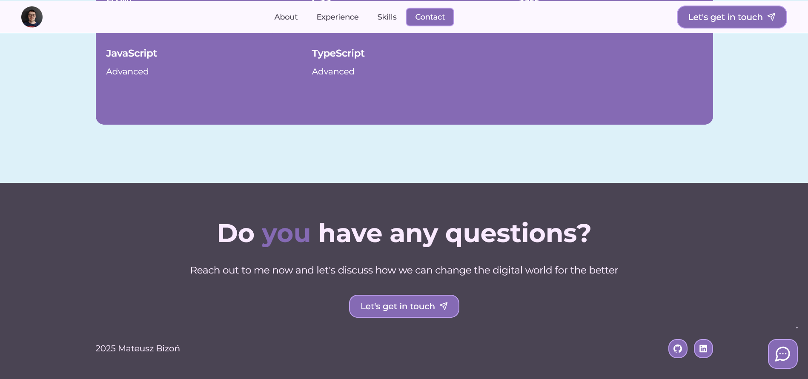

# Matthew's Portfolio

Implemented web site for developer's portfolio. The main goal for this project was to create modern yet minimalist portfolio that extends personal information and includes AI.

## Tech stack

- HTML5
- CSS3
- TypeScript
- Next.js
- TailwindCSS
- Shadcn
- Aceternity UI
- OpenRouter

## Screenshots

